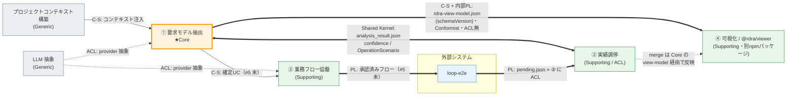

# Context Map

> Phase 4 / DDD — rdra-analyzer の Bounded Context 間関係。[bounded-contexts.md](bounded-contexts.md) の 6 BC ＋ 外部 loop-e2e。
> openQuestion「BC 間の関係種別（特に loop-e2e との上流/下流）」を解消する。

## 図

凡例: `C-S` = Customer-Supplier（U→D）/ `PL` = Published Language / `ACL` = Anticorruption Layer /
`Shared Kernel` = 小さな共有モデル / `==>` = Published Language 境界 / `<==>` = Shared Kernel / `-.->` = ACL 隔離。

## 関係一覧

| # | Upstream | Downstream | 関係 | 統合方式 | 状態 |
|---|----------|-----------|------|---------|------|
| R1 | プロジェクトコンテキスト構築 | ① 要求モデル抽出 | Customer-Supplier | 関数注入（`project_context`） | ✅ |
| R2 | LLM 抽象 | ① 要求モデル抽出 / ③ | ACL（消費側で隔離） | `llm/provider.py` 抽象インターフェース | ✅（③分は #5 未） |
| R3+R8 | ① 要求モデル抽出 ⇔ ② 実績調停 | （双方向） | **Shared Kernel** | `analysis_result.json` ＋ `confidence` / `OperationScenario` 型 | ✅ |
| R4 | **loop-e2e（外部）** | ② 実績調停 | **Published Language ＋ ACL** | `loop-e2e-pending.json`（`reconcile` が `normalize_route` で翻訳） | ✅ |
| R5 | ① 要求モデル抽出 | ③ 業務フロー協働 | Customer-Supplier | 確定 UC 群（同一 `analysis_result.json` 由来） | 🔴 未（#5） |
| R6 | ③ 業務フロー協働 | **loop-e2e（外部）** | **Published Language** | 承認済み業務フローの引き渡し | 🔴 未（#5） |
| R7 | ① 要求モデル抽出 | ④ 可視化 / `@rdra/viewer` | **Customer-Supplier ＋ 内部 Published Language**（下流は Conformist・ACL 無） | `rdra-view-model.json`（`schemaVersion` 付き）をファイル受け渡し | 🟡 切り出し計画（divergence #8） |
| R9 | ② 実績調停 | ④ 可視化 / `@rdra/viewer` | Conformist（間接） | ② の merge は Core の view-model に取り込まれて反映（直接読まない） | 🟡 |

## 統合の詳細

### R3+R8 ① 要求モデル抽出 ⇔ ② 実績調停 — Shared Kernel
- **関係**: Shared Kernel（双方向）。② は ① の出力を読み、新規UC・救済・矛盾を同一成果物へマージし返す。
- **共有モデル**: `analysis_result.json`（UC 集合）＋ 型 `confidence`（`confidence.py`）・`OperationScenario`/`OperationStep`（`scenario_builder`）。
- **統合方式**: ファイル共有（`apply_reconcile` が読み→検証→書き戻し）。`validate()` で参照整合性チェック後のみ書き戻す。
- **境界規律**: 共有は**小さく**保つ。② の救済（棄却→確定昇格・#1 follow-on）と矛盾（#4・コードを真で UC 不変）は Shared Kernel を介す。confidence の意味（confirmed/derived/inferred）を両 BC で一致させる責務。

### R4 loop-e2e → ② 実績調停 — Published Language ＋ ACL
- **関係**: loop-e2e が上流（実績供給）、② が下流。② が腐敗防止層。
- **流れるデータ**: `loop-e2e-pending.json`（実績シナリオ）。**単一チャネル**。loop-e2e は全シナリオをここに書き出すだけで UC 紐付け（突合）をしない。
- **統合方式**: Published Language（rdra-export スキーマ）。突合（ルート照合＋ checkpoint 事実確認＋矛盾検出）は **② の `reconcile` が唯一の調停者**＝ ACL の中核責務。`normalize_route` は loop-e2e spec と同一実装の翻訳契約。
- **ACL の役割**: 外部スキーマを内部 `UseCase`/`OperationScenario` へ翻訳し、Core を loop-e2e の変更から隔離。「コードを真」（#4）は ACL 内の調停ルール。
- **ハードガード**: ② が書く `LE-` シナリオに `provenance="loop-e2e/reconcile"` 印を付与し、`validate()` が印の無い `LE-` を拒否する。loop-e2e による `analysis_result.json` 直接マージ（ACL バイパス）を構造的に不能にする（divergence #9）。
- **状態**: ✅ 単一チャネル化済（divergence #9）。loop-e2e 側 `rdra-export` は全件 pending 化（直接マージ撤去）。

### R6 ③ 業務フロー協働 → loop-e2e — Published Language（未実装）
- **関係**: ③ が上流（承認済み業務フロー供給）、loop-e2e が下流（テスト作成・実行）。
- **境界**: ③ の責務は「生成＋PdM 承認」まで。テスト作成・E2E 実行は越境しない（loop-e2e へ委譲）。
- **状態**: #5（業務フロー協働 BC）deferred ＝ この PL も未実装。Phase 5/9–11 が前提。

### R2 LLM 抽象 → ①/③ — ACL（消費側隔離）
- **関係**: Generic 上流。`llm/provider.py` の抽象インターフェースに Anthropic API / Claude Code CLI が適合。
- **統合方式**: 消費側 ACL。① は具体プロバイダを知らず provider 抽象にのみ依存＝代替可能（Generic の所以）。

### R7 ① 要求モデル抽出 → ④ 可視化 / `@rdra/viewer` — Customer-Supplier ＋ 内部 Published Language
- **関係**: ① が上流（view-model 供給）、`@rdra/viewer` が下流。下流は **Conformist**＝Core の語をそのまま描画する読み取り射影で、**独自モデルを持たないため ACL 無**。
- **流れるデータ**: `rdra-view-model.json` ＝ 現行 `DATA`（`entities`/`relationships`/`usecases`/`scenarios`/`state_machines`/`policies`/`information_groups`/`screen_specs`/`entity_operations`/`uc_entity_crud`）＋ `mermaid_sources` ＋ `generated_at` ＋ **`schemaVersion`**。
- **統合方式**: **ファイルベース Published Language**（loop-e2e PL R4/R6 と同型）。Core が JSON を吐き、`@rdra/viewer` が `npx rdra-viewer ./rdra-view-model.json` で読み描画・配信。サービス（REST/RPC）ではない。
- **PL 是非の判断（本セッションで確定）**: **内部 PL 化を採用**。
  - 理由1: 契約が **Python（Core）↔ Node/npm（viewer）の技術境界**を跨ぎ、独立リリース・独立進化する（`npx` で別途インストール）。Conformist 単独（無契約追従）は同一ビルドで安く再同期できる場合のみ成立し、本件は当てはまらない。
  - 理由2: 既存アーキの一貫性。クロスシステムのファイル契約は全て PL（loop-e2e `pending.json`/`handoff`）。view-model もこれに揃える。
  - 理由3: discovery の Opportunity（独立リリース）を実現し、Threat（暗黙スキーマ固定化で両者破損）を `schemaVersion` で緩和。
- **公開範囲**: **内部 PL に留める（Open Host Service／公開 API 化はしない）**。同一オーナー・rdra 出力専用（Supporting）。"内部仕様で可"（discovery）と矛盾せず、ただ**バージョン付きの共有スキーマ**にする、の意。
- **下流の防御**: 寛容な読み手（未知キーは無視）＋ `schemaVersion` の major 不一致時のみ明示エラー。
- **状態**: 🟡 divergence #8（model 権威・pending）。実装は将来の sync。

## #7（コード構造リファクタ）への含意

関係種別が確定したことで sync #7 の前提が外れた。Shared Kernel（R3+R8）と Published Language（R4/R6）が
パッケージ境界の指針になる:

- **`shared/`** ← Shared Kernel: `confidence` ＋ `scenario_builder`（`OperationScenario`/`OperationStep`）。①②④ が依存。
- **`extraction/`**（① Core）/ **`reconciliation/`**（② ACL）は Shared Kernel 越しに結合。ACL 翻訳（`normalize_route` 等）は `reconciliation/` 内に閉じる。
- **`workflow/`**（③）/ **`visualization/`**（④）/ **`llm/`** / **`context/`**（Generic）。
- loop-e2e との PL スキーマ（pending.json）は `reconciliation/` の公開境界に置く。

→ ✅ **sync #7 で実装済**（別 PR `refactor/bc-aligned-packages`）。`shared/`＝Shared Kernel、`reconciliation/` に ACL 翻訳を閉じ込め、各 BC パッケージへ移行。`Usecase`→`UseCase` 統一。157 passed。

## 言語の境界で発見した事実（mapping）

- **loop-e2e は単一の関係ではなく双方向の別契約**: ② への上流（実績 PL）と ③ からの下流（承認済みフロー PL）。同じ外部システムだが BC ごとに役割が反転する。
- **① と ② は対等な Partnership ではなく Shared Kernel**: Core↔Supporting の非対称があり、共有を `analysis_result.json` ＋少数の型に限定して結合を管理する方が健全。
- **④ 可視化と ② 実績調停は「同じ Supporting でも ACL 要否が逆」**: ② は外部 loop-e2e の言語を翻訳するため ACL あり。④ は Core の語をそのまま描く読み取り射影のため ACL 無。`@rdra/viewer` 分離でこの差が物理パッケージ境界として顕在化する。
- **PL は「公開 API」ではなく「跨ぎ境界のバージョン付き共有スキーマ」**: `@rdra/viewer` は内部 PL（同一オーナー・rdra専用）で十分。Open Host Service 化（公開ビューワーAPI）は不要 ＝ 旧 openQuestion をクローズ。

## 未解決の問い

- Shared Kernel（`analysis_result.json`）のスキーマ所有者は ① か、共同管理か（Phase 5/6 で版管理方針）。
- ~~④ 可視化は Conformist でよいか、Open Host（ビューワー API）化する余地はあるか~~ → ✅ **確定**: 下流 Conformist のまま、統合は**内部 Published Language（`rdra-view-model.json` ＋ `schemaVersion`）**。**OHS／公開 API 化はしない**（R7 詳細参照）。実装は divergence #8（将来 sync）。
- R5/R6（③ 業務フロー協働の PL）は #5 実装時に具体化（Phase 5/9–11 後）。
- `rdra-view-model.json` の出力工程をどのコマンドに載せるか（`viewer --export-only` / `rdra` 追加出力 / 新規 `export`）は sync #8 計画時に確定（discovery 未解決と同一）。
